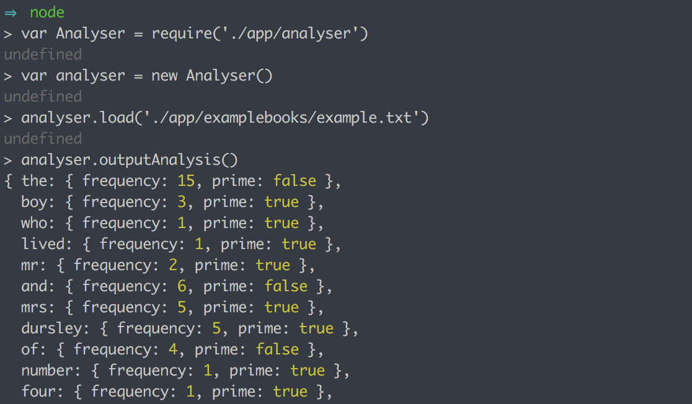
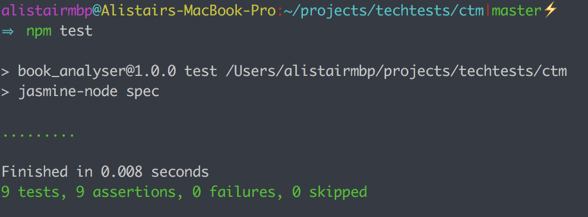

# bookAnalyser
A node app that analyses words in a book

## The Task

1. Output the individual words that appear in a book, and how many times that word appears in the text file.

2. Also output whether the number of times each word appears is a prime number.

## User Stories

```
So I may see how what words appear on a book
I would like to be able to load a text file
```

```
So I may see what words appear on a book
I would like to output each unique word in a text file
```

```
So I may see what the most common words are
I would like to see the frequency of each word
```

```
So I may identify prime numbers
I would like to see whether each frequency is a prime number
```

## How to Run

```
$ git clone https://github.com/alistairkung/bookAnalyser.git
$ cd bookAnalyser
$ npm install
```
In node:

```
$ var Analyser = require('./app/analyser')
$ var analyser = new Analyser()
$ analyser.load('./app/examplebooks/example.txt')
$ analyser.outputAnalysis()
```



## Tests

This application was written following a strict TDD approach. To run the tests type the following into the terminal:

```
$ npm test
```



## Approach

* TDD: Developed following TDD using Jasmine-node, religiously following the red, green refactor loop.

* Javascript: Having been encouraged on the course to write in pure Javascript, I have not used any libraries other than Jasmine as a testing framework. Composed in an OO style using the constructor and prototype pattern.

* Node: On the course, I did not have the chance to build a project in Node so I decided to take this opportunity to pick it up. To demonstrate my OO principles I chose to follow the module export interface pattern, taking into consideration the responsibilities of each module.

* Modules: The WordCounter and PrimeChecker are two fully reusable components which are completely decoupled modularised units and can be reused in future projects. The Analyser module uses the WordCounter and PrimeChecker modules to output the request analysis from the specification.

* Methods: It was important to me that the user was presented with both word frequencies and associated primality after running one public method (i.e. outputAnalysis()), rather than having to run an individual method for each output. This was because the information seemed more presentable and meaningful when shown together and I anticipated that there may be repetition in code if I were to have independent methods.

* Output: My ultimate output is in a JSON style format.

```
{
  "one":{frequency: 4, prime:false},
  "two":{frequency: 1, prime:true},
  "three":{frequency: 1, prime:true},
  "four":{frequency: 2, prime:true},
  "five":{frequency: 1, prime:true}
}
```
This is because I intend to expand this project into a node API and I would like therefore for my methods and modules to easily transition and be reused in an API (e.g. receive get request with a string, return JSON with frequency and primality). I want to do this as I have not made an API using node before and this project seemed like a good starting point since i'm learning to use Node anyway.  

#### Experimenting with efficiency

* isPrime algorithm: I put in some time to research primality algorithms and eventually decided on this approach as this significantly cuts down the number of divisions that need to be calculated. By taking into account the base cases(i.e. 2, 3 and n % 2 == 0), the divisor is incremented by 2 at a time which reduces the amount of divisions that take place. If I had more time I would try to research more into probabilistic prime tests which would make the program even more efficient.

* Creating an array of unique primes(Probably bad idea): I had an idea at one point that if I preprocessed the text file through the Analysis module, flattening all the frequencies into an array that contains only unique, prime frequencies, then my PrimeChecker method will run fewer times and hence be more efficient....

It was only until I had finished implementing this that it struck me that the most time taxing aspect of the algorithm was the number of divisions not the number of times the method is called. I realised when I finished that this method scales poorly with longer books and would only make sense if the range of prime numbers is small and predictable. In this case, the bigger the book, the less predictable the prime numbers and hence, the simpler approach may make more sense.

I decided not to merge these changes in the end. However there was quite a lot of code written to achieve this(part due to Javascript's lack of set theory but also that I didn't have enough time to refactor) so I left code on the following branch to be seen(It's also fully tested code!):

```
Branch: array_of_unique_primes
```

## Reflections

* Having not previously used Node, there was a bit of a learning curve at the start to get up and running and I am happy that I got there in the end and learnt to use the module export pattern.
* I spent a lot of time trying to implement an idea which I realised late on probably does not make my application more efficient (explained in above section). However the valuable lesson I took away is that it is important to think carefully before making changes to optimise an application. If I had though about scalability (i.e. a bigger book) earlier I probably would not have tried to implement my approach.
* I did not have time to find a way to bench mark my two implementations(nor have I tried to do any benchmarking in the past), but I would be very curious to prove my new hypothesis that the simpler approach is faster.
* I would like to have had more time to refactor and improve the general code quality, especially in the Analyser class. For example the load method has two responsibilities right now. It reads a text file but also sanitises the string to be usable by the wordCounter. The two responsibilities should be decoupled and extracted.
